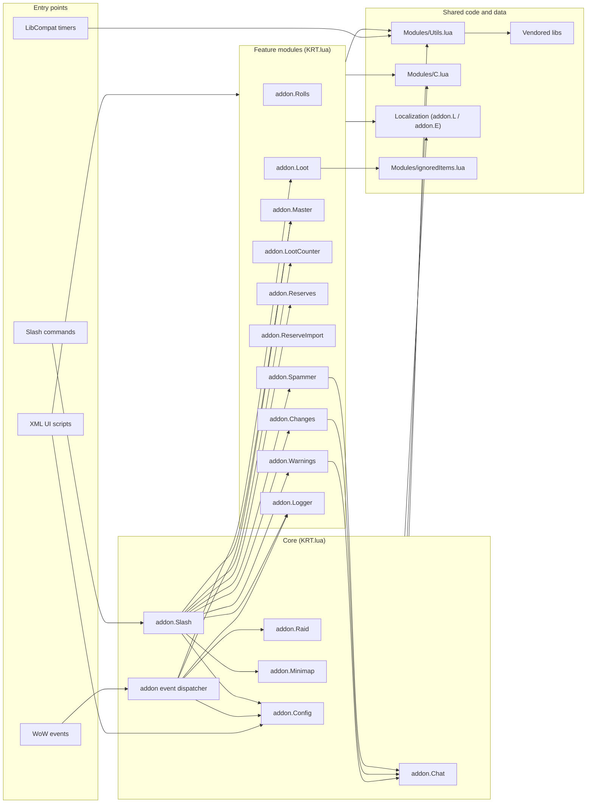
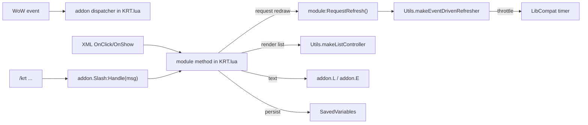

# Architecture Overview

Purpose: in ~5 minutes, understand what exists, where it lives, and where to edit safely.
This is the primary start-here doc for contributors and coding agents.

Keep this document navigational:
- architecture and ownership,
- entry points and data boundaries,
- high-signal links to code.

Behavior details belong in code and in `CHANGELOG.md`.
Process and invariants belong in `AGENTS.md`.

---

## At A Glance

- Runtime target: WoW 3.3.5a (Interface 30300), Lua 5.1.
- Addon folder name is intentionally `!KRT`.
- Core is monolithic: feature logic lives in `!KRT/KRT.lua`.
- UI is XML-driven (`!KRT/KRT.xml`, `!KRT/Templates.xml`) with thin script glue.
- Shared helpers/constants live in `!KRT/Modules/Utils.lua` and `!KRT/Modules/C.lua`.
- Static data list: `!KRT/Modules/ignoredItems.lua`.
- Slash entry points: `/krt`, `/kraidtools` with subcommands (including `/krt counter`).
- Persistence uses account-wide SavedVariables declared in `!KRT/!KRT.toc`.

---

## Repository Map

```text
!KRT/
  !KRT.toc                 # load order + SavedVariables declaration
  KRT.lua                  # monolith: core + feature modules
  KRT.xml                  # main UI frame definitions
  Templates.xml            # shared XML templates

  Localization/
    localization.en.lua    # user-facing strings (addon.L)
    ErrorLog.en.lua        # log/debug templates (addon.E)

  Modules/
    Utils.lua              # generic utilities + UI controllers
    C.lua                  # constants/enums/patterns
    ignoredItems.lua       # static item filters/data

  Libs/                    # vendored libs loaded from toc
```

---

## Runtime Topology

### 1) System map



### 2) Integration contracts



Key contracts:
- Event handlers are registered in `KRT.lua` and dispatched via module methods.
- XML handlers should delegate to module methods; avoid embedding feature logic in XML.
- UI updates should be event-driven (`RequestRefresh`/`Refresh`), not polling loops.
- Lists should use `Utils.makeListController(...):Dirty()` when possible.

---

## Module Ownership

Top-level modules defined in `!KRT/KRT.lua`:

- `addon.Raid`: raid/session state, roster updates, instance context.
- `addon.Chat`: chat output helpers (print/announce).
- `addon.Minimap`: minimap button and menu behavior.
- `addon.Rolls`: roll collection, sorting, winner logic.
- `addon.Loot`: loot parsing and item selection glue.
- `addon.Master`: master-loot workflow, award/trade handling.
- `addon.LootCounter`: player loot counts UI and data updates.
- `addon.Reserves`: soft-reserve model and reserve list UI.
- `addon.ReserveImport`: SR import UI and CSV validation.
- `addon.Config`: options defaults/load and config UI.
- `addon.Warnings`: warning list CRUD and announces.
- `addon.Changes`: MS changes list and announce flows.
- `addon.Spammer`: LFM message composition and spam loop.
- `addon.Logger`: loot logger UI and raid/boss/loot editing.
- `addon.Slash`: slash command parser and dispatch table.

`addon.Logger` internal layering pattern:
- `addon.Logger.Store`: data access and stable-id indexing.
- `addon.Logger.View`: view-model row builders.
- `addon.Logger.Actions`: mutation paths and refresh boundaries.

---

## Slash Commands (Current)

Primary commands:
- `/krt`
- `/kraidtools`

Important subcommands routed by `addon.Slash` in `!KRT/KRT.lua`:
- `config`
- `lfm`/`pug`
- `ach`
- `changes`/`ms`
- `warnings`/`rw`
- `logger`
- `debug`
- `loot`/`ml`
- `counter` (toggles Loot Counter)
- `reserves`/`res`
- `minimap`

Notes:
- Empty `/krt` message does nothing by design.
- `/krt show` and `/krt toggle` open/close Master Looter.

---

## SavedVariables Boundary

Declared in `!KRT/!KRT.toc`:

- `KRT_Options`
- `KRT_Raids`
- `KRT_Players`
- `KRT_Warnings`
- `KRT_ExportString`
- `KRT_Spammer`
- `KRT_CurrentRaid`
- `KRT_LastBoss`
- `KRT_NextReset`
- `KRT_SavedReserves`
- `KRT_PlayerCounts`

Rule of thumb:
- Preserve key names and shapes.
- If schema changes are unavoidable, add migration logic and document behavior in `CHANGELOG.md`.

---

## Dependency Rules

- Feature logic stays in `!KRT/KRT.lua` module blocks.
- `Modules/Utils.lua` and `Modules/C.lua` stay generic; no feature dependencies.
- `Localization/*.lua` defines strings only; no feature logic.
- No Ace3.
- Use WoW 3.3.5a-compatible APIs only (avoid modern `C_`/`C_Timer` APIs).

Load order matters (`!KRT/!KRT.toc`):
1. Vendored libs
2. Localization files
3. `Templates.xml`
4. `Modules/Utils.lua`, `Modules/C.lua`
5. `KRT.lua`
6. `KRT.xml`
7. `Modules/ignoredItems.lua`

---

## Where To Edit (Common Tasks)

Add or change a slash command:
- `!KRT/KRT.lua` in the `addon.Slash` block.
- Add help text in `!KRT/Localization/localization.en.lua`.
- If user-visible, record in `CHANGELOG.md`.

Add or change a feature window/list:
- UI layout: `!KRT/KRT.xml` or `!KRT/Templates.xml`.
- Module behavior: `!KRT/KRT.lua`.
- Prefer `Utils.makeEventDrivenRefresher` and `Utils.makeListController`.

Add or change option behavior:
- Defaults/load path in `addon.Config` (`!KRT/KRT.lua`).
- Keep `KRT_Options` and `addon.options` in sync on writes.

Add or change displayed text/log templates:
- User-facing text: `!KRT/Localization/localization.en.lua` (`addon.L`).
- Log/debug templates: `!KRT/Localization/ErrorLog.en.lua` (`addon.E`).

---

## Smoke Test Checklist

Use this quick pass after behavior changes:

- Login with no Lua errors; `/krt` UI opens.
- Raid detection/roster updates still trigger expected refreshes.
- Rolls (MS/OS/SR) sort and resolve deterministically.
- Reserves import/export and reserve gating still work.
- Logger append/filter/edit/delete flows still update selection and lists.
- Master award/trade flows still behave correctly.
- `/krt counter` toggles Loot Counter.
- `/reload` preserves expected state.

---

## Related Docs

- Working rules and invariants: `AGENTS.md`
- User-visible change history: `CHANGELOG.md`
- High-level feature narrative (legacy): `README.md`
