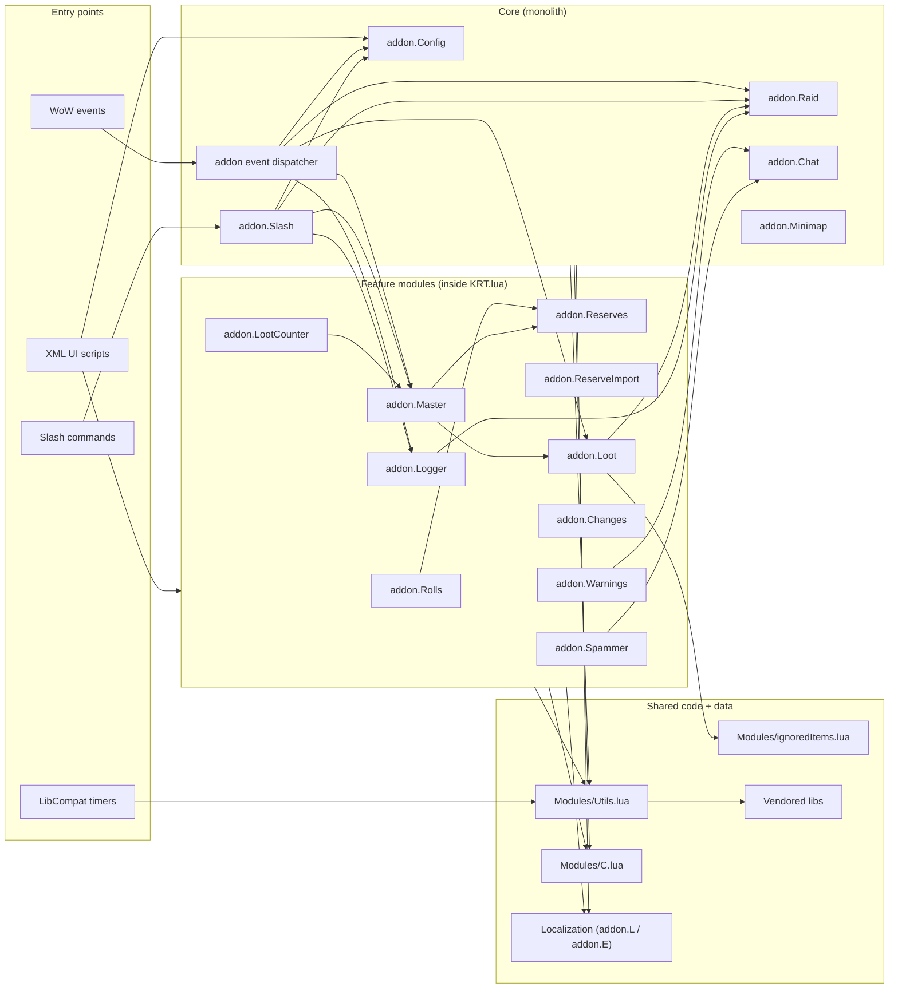
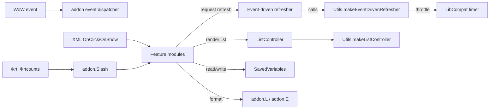
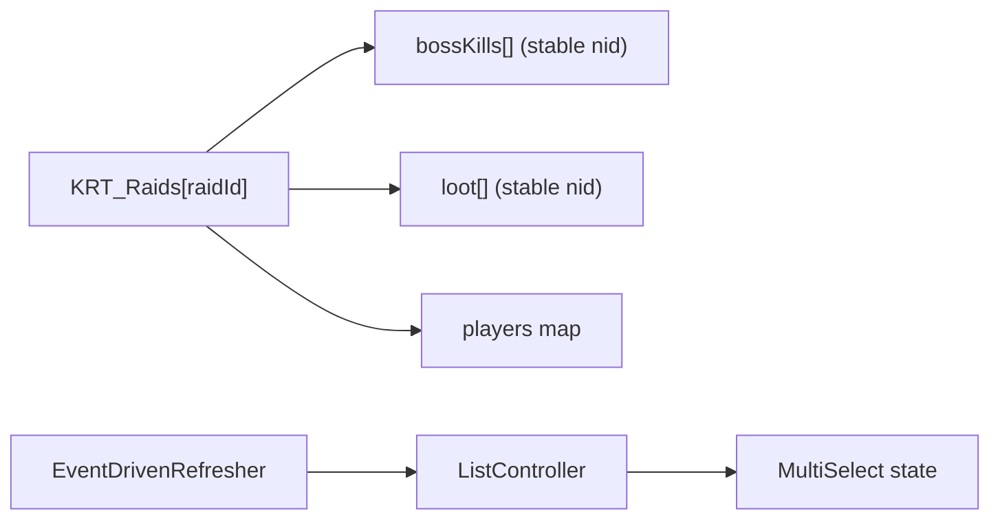

# Architecture Overview

Goal: in ~5 minutes, understand **what exists**, **where it lives**, and **how modules interact**.
This is the primary “start here” card for humans and AI coding agents.

Single source of truth: keep this doc navigational and coarse (diagrams + links).
Detailed behaviour belongs in `docs/Features/*`; detailed decisions/invariants belong in `docs/ADR/*`.

---

## Summary (keep it short)

- **System:** World of Warcraft addon `!KRT` (WotLK 3.3.5a / Interface 30300), Lua 5.1 + XML UI.
- **Where is the code:** runtime code lives under [`!KRT/`](../../!KRT/). Core logic is **monolithic** in
  [`!KRT/KRT.lua`](../../!KRT/KRT.lua). UI layout in [`!KRT/KRT.xml`](../../!KRT/KRT.xml) and
  [`!KRT/Templates.xml`](../../!KRT/Templates.xml).
- **Entry points:** WoW events (e.g., `ADDON_LOADED`), XML UI scripts (OnShow/OnClick), slash commands
  (`/krt`, `/kraidtools`, `/krtcounts`), LibCompat timers used for throttling.
- **Dependencies:** vendored libs via [`!KRT/Libs/`](../../!KRT/Libs/) (LibStub, LibCompat, LibLogger, etc.),
  localization via [`!KRT/Localization/`](../../!KRT/Localization/), shared helpers in
  [`!KRT/Modules/Utils.lua`](../../!KRT/Modules/Utils.lua) and [`!KRT/Modules/C.lua`](../../!KRT/Modules/C.lua).

---

## Scoping (read first)

- **In scope:** changes inside `!KRT/KRT.lua` module blocks, UI scripts in `KRT.xml/Templates.xml`,
  localization (`Localization/*.lua`), and shared controllers in `Modules/Utils.lua`.
- **Out of scope:** WoW client API behavior, third-party libs internals, adding Ace3, changing addon folder name.

How to map a change quickly:
- Pick impacted module(s) from the diagram + module index (with links).
- Pick entry point(s): event / UI / slash / timer.
- Read only: linked docs → entry-point file(s) → minimum dependencies.
- If scope can’t be mapped to this doc, update this doc (or ask one clarifying question).

---

## 2) Diagrams (Mermaid) — primary context

Diagrams are for humans and AI agents. They must be self-describing.
Model real modules/interfaces and key shared helpers (not every file).

### 2.1 System / module map (blocks + modules)

### 2.2 Interfaces / contracts map (how modules talk)

Contracts to remember:
- **WoW events → addon dispatcher:** event registration + `OnEvent` bridge in `KRT.lua`.
- **UI scripts → modules:** XML handlers should stay thin and delegate into module methods.
- **Refresh contract:** `module:RequestRefresh()` / `module:Refresh()` via `Utils.makeEventDrivenRefresher`.
- **Lists contract:** `Utils.makeListController` provides row pooling, sorting, and `controller:Dirty()`.

### 2.3 Key data structures / types map (high-signal only)

---

## 3) Navigation index (required, keep it tiny)

Goal: jump from any diagram element to the right docs/code without repo-wide scanning.

### 3.1 Modules (diagram nodes)

- **Core / entry plumbing**
  - `addon event dispatcher` — code: [`!KRT/KRT.lua`](../../!KRT/KRT.lua) (search: `SetScript("OnEvent"`).
  - `addon.Slash` — code: [`!KRT/KRT.lua`](../../!KRT/KRT.lua) (search: `SLASH_KRT1` / `SlashCmdList`).
  - `addon.Config` — code: [`!KRT/KRT.lua`](../../!KRT/KRT.lua) (search: `addon.Config =`).

- **Feature modules (all in `KRT.lua`)**
  - `addon.Raid` — state/roster/session helpers; code: [`!KRT/KRT.lua`](../../!KRT/KRT.lua) (search: `addon.Raid`).
  - `addon.Rolls` — roll tracking + winner logic; code: [`!KRT/KRT.lua`](../../!KRT/KRT.lua) (search: `addon.Rolls`).
  - `addon.Reserves` — SR model + list UI; code: [`!KRT/KRT.lua`](../../!KRT/KRT.lua) (search: `addon.Reserves`).
  - `addon.ReserveImport` — SR import window glue; code: [`!KRT/KRT.lua`](../../!KRT/KRT.lua) (search: `addon.ReserveImport`).
  - `addon.Loot` — loot parsing/selection/export; code: [`!KRT/KRT.lua`](../../!KRT/KRT.lua) (search: `addon.Loot`).
  - `addon.Master` — master-loot helpers/award/trade; code: [`!KRT/KRT.lua`](../../!KRT/KRT.lua) (search: `addon.Master`).
  - `addon.LootCounter` — loot counter UI/data; code: [`!KRT/KRT.lua`](../../!KRT/KRT.lua) (search: `addon.LootCounter`).
  - `addon.Logger` — loot history UI/store/actions; code: [`!KRT/KRT.lua`](../../!KRT/KRT.lua) (search: `addon.Logger`).
  - `addon.Warnings` — announce templates/throttling; code: [`!KRT/KRT.lua`](../../!KRT/KRT.lua) (search: `addon.Warnings`).
  - `addon.Changes` — MS changes list/announce; code: [`!KRT/KRT.lua`](../../!KRT/KRT.lua) (search: `addon.Changes`).
  - `addon.Spammer` — LFM helper; code: [`!KRT/KRT.lua`](../../!KRT/KRT.lua) (search: `addon.Spammer`).
  - `addon.Minimap` — minimap button + EasyMenu; code: [`!KRT/KRT.lua`](../../!KRT/KRT.lua) (search: `addon.Minimap`).
  - `addon.Chat` — chat output helpers; code: [`!KRT/KRT.lua`](../../!KRT/KRT.lua) (search: `addon.Chat`).

- **Shared / data**
  - `Utils` — controllers, refreshers, list utils: [`!KRT/Modules/Utils.lua`](../../!KRT/Modules/Utils.lua)
  - `C` — constants/enums/patterns: [`!KRT/Modules/C.lua`](../../!KRT/Modules/C.lua)
  - `ignoredItems` — data list/filter: [`!KRT/Modules/ignoredItems.lua`](../../!KRT/Modules/ignoredItems.lua)
  - UI layout: [`!KRT/KRT.xml`](../../!KRT/KRT.xml), templates: [`!KRT/Templates.xml`](../../!KRT/Templates.xml)

### 3.2 Interfaces / contracts (diagram edges)

- **Event dispatcher (`WoW event` → `addon`):**
  - Source of truth: [`!KRT/KRT.lua`](../../!KRT/KRT.lua) (search: `RegisterEvent`).
- **Slash commands:**
  - Source of truth: [`!KRT/KRT.lua`](../../!KRT/KRT.lua) (search: `SLASH_KRT1`, `SlashCmdList`).
- **Event-driven UI refresh (Request → Refresh):**
  - Source of truth: [`!KRT/Modules/Utils.lua`](../../!KRT/Modules/Utils.lua) (search: `makeEventDrivenRefresher`).
- **List rendering + row pooling:**
  - Source of truth: [`!KRT/Modules/Utils.lua`](../../!KRT/Modules/Utils.lua) (search: `makeListController`).
- **Localization contract (`addon.L` / `addon.E`):**
  - User strings: [`!KRT/Localization/localization.en.lua`](../../!KRT/Localization/localization.en.lua)
  - Log templates: [`!KRT/Localization/ErrorLog.en.lua`](../../!KRT/Localization/ErrorLog.en.lua)
- **SavedVariables schema:**
  - Declared in toc: [`!KRT/!KRT.toc`](../../!KRT/!KRT.toc)
  - Used by code: [`!KRT/KRT.lua`](../../!KRT/KRT.lua) (search: `KRT_Options`, `KRT_Raids`, etc.)

---

## 4) Dependency rules (must be explicit)

- **Allowed dependencies:**
  - Any feature module may depend on `Utils`, `C`, `addon.L` / `addon.E`.
  - Feature modules may call other feature modules when it is a real domain dependency (avoid cycles).
  - UI (`KRT.xml`) may call module methods, but should not contain core logic.

- **Forbidden dependencies:**
  - `Modules/Utils.lua` and `Modules/C.lua` must not depend on feature modules.
  - Localization files must not depend on feature modules.
  - Do not introduce Ace3.

- **Integration style:**
  - Prefer sync calls (module → module) with explicit refresh requests.
  - Prefer event-driven refresh (no polling `OnUpdate` loops for feature UI).
  - Use LibCompat timers for throttling (not modern `C_Timer`).

- **Shared code policy:**
  - Shared helpers belong in `Modules/Utils.lua` (or a small new reusable file if justified).
  - Static data lists belong in `Modules/*.lua` and must be documented in the changelog if added.

---

## 5) Key decisions (ADRs)

This repo currently encodes architectural decisions in:
- [`AGENTS.md`](../../AGENTS.md) — binding rules (monolith, load order, event-driven UI refresh, language policy).
- [`CHANGELOG.md`](../../CHANGELOG.md) — user-visible change history.

If/when ADRs are introduced:
- Put them under `docs/ADR/` and link them here.

---

## 6) Where to go next

- Agent rules: [`AGENTS.md`](../../AGENTS.md)
- Change history: [`CHANGELOG.md`](../../CHANGELOG.md)
- Runtime core: [`!KRT/KRT.lua`](../../!KRT/KRT.lua)
- Shared controllers: [`!KRT/Modules/Utils.lua`](../../!KRT/Modules/Utils.lua)
- UI: [`!KRT/KRT.xml`](../../!KRT/KRT.xml), [`!KRT/Templates.xml`](../../!KRT/Templates.xml)
