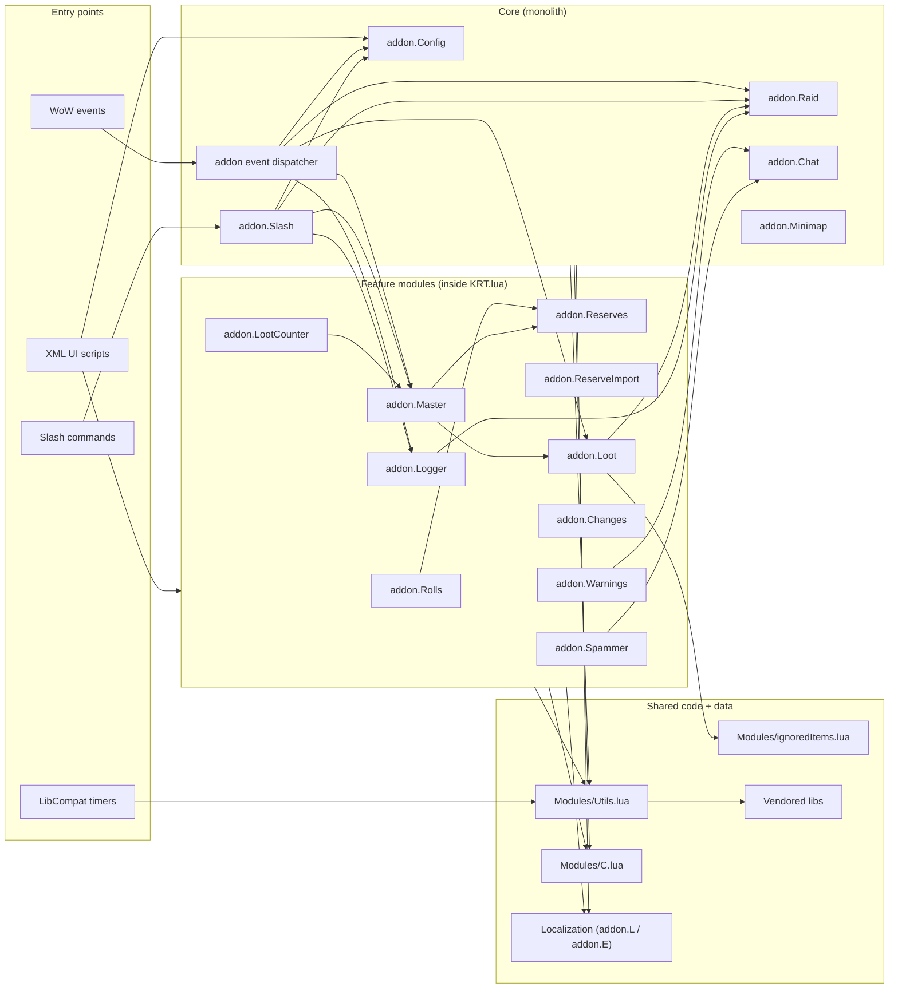
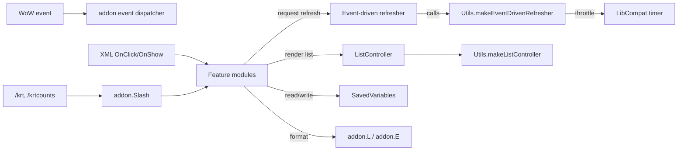
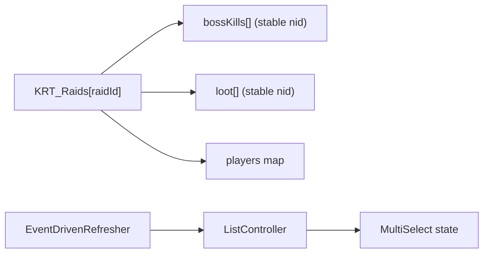

# Architecture Overview

Goal: in ~5 minutes, understand **what exists**, **where it lives**, and **how modules interact**.
This is the primary “start here” doc for humans and AI coding agents.

Keep it navigational and coarse (diagrams + links).
Detailed behaviour belongs in `docs/Features/*`; detailed decisions/invariants belong in `docs/ADR/*`.

---

## Summary

- **System:** World of Warcraft addon `!KRT` (WotLK 3.3.5a / Interface 30300), Lua 5.1 + XML UI.
- **Where is the code:** runtime code lives under [`!KRT/`](../../!KRT/). Core logic is **monolithic** in
  [`!KRT/KRT.lua`](../../!KRT/KRT.lua). UI layout in [`!KRT/KRT.xml`](../../!KRT/KRT.xml) and
  [`!KRT/Templates.xml`](../../!KRT/Templates.xml).
- **Entry points:** WoW events (e.g., `ADDON_LOADED`), XML UI scripts (OnShow/OnClick), slash commands
  (`/krt`, `/kraidtools`, `/krtcounts`), LibCompat timers used for throttling.
- **Dependencies:** vendored libs via [`!KRT/Libs/`](../../!KRT/Libs/) (LibStub, LibCompat, LibLogger, etc.),
  localization via [`!KRT/Localization/`](../../!KRT/Localization/), shared helpers in
  [`!KRT/Modules/Utils.lua`](../../!KRT/Modules/Utils.lua) and [`!KRT/Modules/C.lua`](../../!KRT/Modules/C.lua).

---

## Scoping (read first)

- **In scope:** changes inside `!KRT/KRT.lua` module blocks, UI scripts in `KRT.xml/Templates.xml`,
  localization (`Localization/*.lua`), and shared controllers in `Modules/Utils.lua`.
- **Out of scope:** WoW client API behavior, third-party libs internals, adding Ace3, changing addon folder name.

How to map a change quickly:
- Pick impacted module(s) from the diagram + module index (with links).
- Pick entry point(s): event / UI / slash / timer.
- Read only: linked docs → entry-point file(s) → minimum dependencies.
- If scope can’t be mapped to this doc, update this doc (or ask one clarifying question).

---

## Diagrams (Mermaid)

### 1) System / module map

### 2) Interfaces / contracts map

Contracts to remember:
- **WoW events → addon dispatcher:** event registration + `OnEvent` bridge in `KRT.lua`.
- **UI scripts → modules:** XML handlers should stay thin and delegate into module methods.
- **Refresh contract:** `module:RequestRefresh()` / `module:Refresh()` via `Utils.makeEventDrivenRefresher`.
- **Lists contract:** `Utils.makeListController` provides row pooling, sorting, and `controller:Dirty()`.

### 3) Key data structures (high-signal only)

---

## Navigation index

### Modules (diagram nodes)

- **Core / entry plumbing**
  - `addon event dispatcher` — [`!KRT/KRT.lua`](../../!KRT/KRT.lua) (search: `SetScript("OnEvent"`).
  - `addon.Slash` — [`!KRT/KRT.lua`](../../!KRT/KRT.lua) (search: `SLASH_KRT1` / `SlashCmdList`).
  - `addon.Config` — [`!KRT/KRT.lua`](../../!KRT/KRT.lua) (search: `addon.Config =`).

- **Feature modules (all in `KRT.lua`)**
  - `addon.Raid` — [`!KRT/KRT.lua`](../../!KRT/KRT.lua) (search: `addon.Raid`).
  - `addon.Rolls` — [`!KRT/KRT.lua`](../../!KRT/KRT.lua) (search: `addon.Rolls`).
  - `addon.Reserves` — [`!KRT/KRT.lua`](../../!KRT/KRT.lua) (search: `addon.Reserves`).
  - `addon.ReserveImport` — [`!KRT/KRT.lua`](../../!KRT/KRT.lua) (search: `addon.ReserveImport`).
  - `addon.Loot` — [`!KRT/KRT.lua`](../../!KRT/KRT.lua) (search: `addon.Loot`).
  - `addon.Master` — [`!KRT/KRT.lua`](../../!KRT/KRT.lua) (search: `addon.Master`).
  - `addon.LootCounter` — [`!KRT/KRT.lua`](../../!KRT/KRT.lua) (search: `addon.LootCounter`).
  - `addon.Logger` — [`!KRT/KRT.lua`](../../!KRT/KRT.lua) (search: `addon.Logger`).
  - `addon.Warnings` — [`!KRT/KRT.lua`](../../!KRT/KRT.lua) (search: `addon.Warnings`).
  - `addon.Changes` — [`!KRT/KRT.lua`](../../!KRT/KRT.lua) (search: `addon.Changes`).
  - `addon.Spammer` — [`!KRT/KRT.lua`](../../!KRT/KRT.lua) (search: `addon.Spammer`).
  - `addon.Minimap` — [`!KRT/KRT.lua`](../../!KRT/KRT.lua) (search: `addon.Minimap`).
  - `addon.Chat` — [`!KRT/KRT.lua`](../../!KRT/KRT.lua) (search: `addon.Chat`).

- **Shared / data**
  - `Utils` — [`!KRT/Modules/Utils.lua`](../../!KRT/Modules/Utils.lua)
  - `C` — [`!KRT/Modules/C.lua`](../../!KRT/Modules/C.lua)
  - `ignoredItems` — [`!KRT/Modules/ignoredItems.lua`](../../!KRT/Modules/ignoredItems.lua)
  - UI: [`!KRT/KRT.xml`](../../!KRT/KRT.xml), templates: [`!KRT/Templates.xml`](../../!KRT/Templates.xml)

### Interfaces / contracts (diagram edges)

- **Event dispatcher (`WoW event` → `addon`):** [`!KRT/KRT.lua`](../../!KRT/KRT.lua) (search: `RegisterEvent`).
- **Slash commands:** [`!KRT/KRT.lua`](../../!KRT/KRT.lua) (search: `SLASH_KRT1`, `SlashCmdList`).
- **Event-driven UI refresh:** [`!KRT/Modules/Utils.lua`](../../!KRT/Modules/Utils.lua) (search: `makeEventDrivenRefresher`).
- **List rendering + row pooling:** [`!KRT/Modules/Utils.lua`](../../!KRT/Modules/Utils.lua) (search: `makeListController`).
- **Localization (`addon.L` / `addon.E`):**
  - [`!KRT/Localization/localization.en.lua`](../../!KRT/Localization/localization.en.lua)
  - [`!KRT/Localization/ErrorLog.en.lua`](../../!KRT/Localization/ErrorLog.en.lua)
- **SavedVariables schema:**
  - Declared: [`!KRT/!KRT.toc`](../../!KRT/!KRT.toc)
  - Used: [`!KRT/KRT.lua`](../../!KRT/KRT.lua) (search: `KRT_Options`, `KRT_Raids`, etc.)

---

## Dependency rules (explicit)

- **Allowed:**
  - Feature modules may depend on `Utils`, `C`, `addon.L` / `addon.E`.
  - Feature modules may call other feature modules when it is a real domain dependency (avoid cycles).
  - XML UI may call module methods, but should not contain core logic.

- **Forbidden:**
  - `Modules/Utils.lua` and `Modules/C.lua` must not depend on feature modules.
  - Localization files must not depend on feature modules.
  - Do not introduce Ace3.

- **Integration style:**
  - Prefer sync calls (module → module) with explicit refresh requests.
  - Prefer event-driven refresh (no polling `OnUpdate` loops for feature UI).
  - Use LibCompat timers for throttling (not modern `C_Timer`).

---

## Where to go next

- Agent rules: [`AGENTS.md`](../../AGENTS.md)
- Change history: [`CHANGELOG.md`](../../CHANGELOG.md)
- Runtime core: [`!KRT/KRT.lua`](../../!KRT/KRT.lua)
- Shared controllers: [`!KRT/Modules/Utils.lua`](../../!KRT/Modules/Utils.lua)
- UI: [`!KRT/KRT.xml`](../../!KRT/KRT.xml), [`!KRT/Templates.xml`](../../!KRT/Templates.xml)
